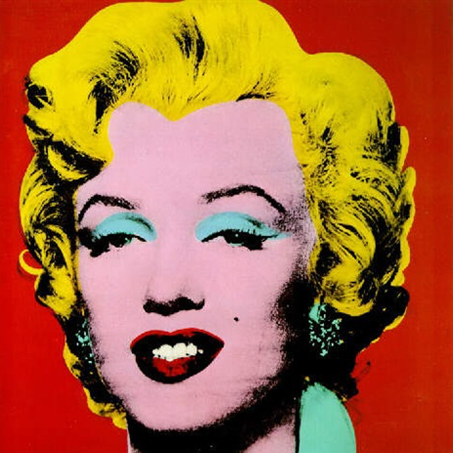
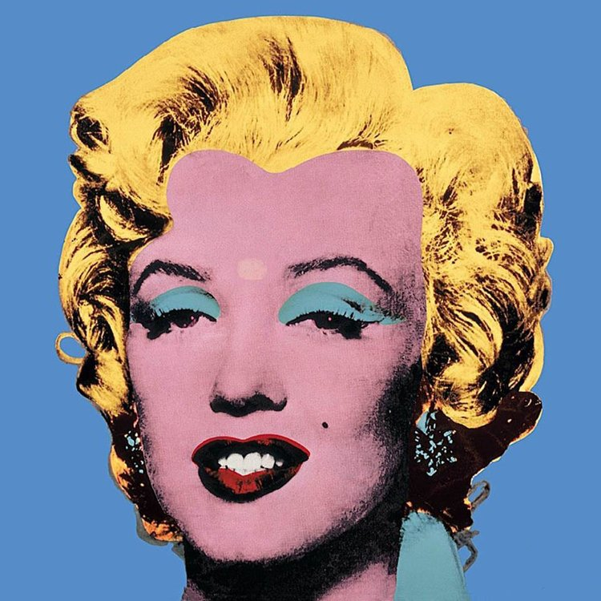
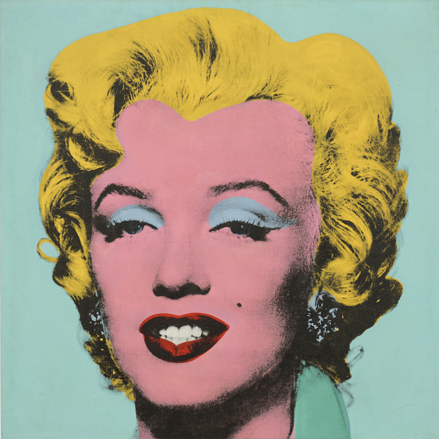
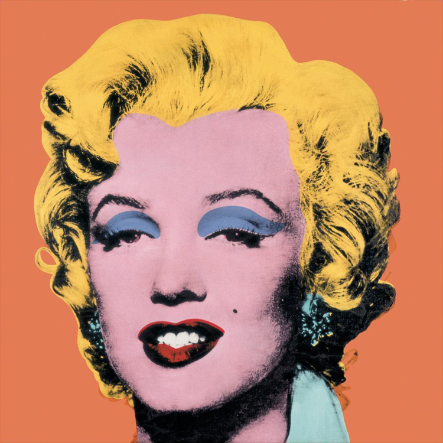
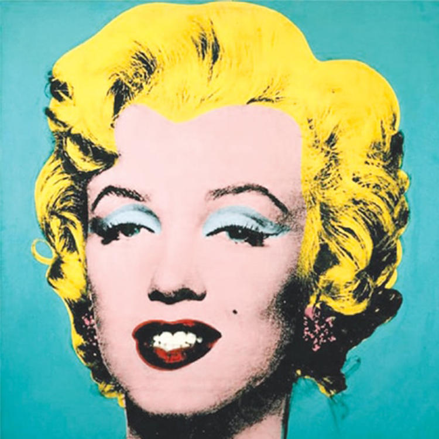

# Warhol's Marilyn Monroe — Color Analysis | UC Davis STA 160 Final Project

<!-- BADGES_BEGIN -->

  
  
  
  
  
  

  
  
  
  
  
  
  
  
  

<!-- BADGES_END -->

**Course:** STA 160, Spring 2023 — UC Davis
**Author:** Chiyang Chen

  
  
  
  
  

## Project Description

A statistical and visual analysis of color properties across five of Andy Warhol's iconic 1964 *Marilyn Monroe* silkscreen prints. The five color variants analyzed are: **Red**, **Light Blue**, **Sega Blue**, **Orange**, and **Turquoise**.

The project applies image processing, K-Means clustering, conditional entropy, and HSV color manipulation to quantify and compare the color composition of each print, and to programmatically modify specific regions of interest (e.g., eyeshadow).

## Analysis Sections

| Section | Description |
|---|---|
| Color Analysis | RGB & HSV visualization, 3D interactive plots, conditional entropy between color channels |
| Region Identification | Background, hair, and eyeshadow segmentation using color thresholding and deep learning |
| K-Means Color Extraction | Cluster image colors at varying k; compare color distributions across prints |
| Eyeshadow Color Modification | HSV-based masking to programmatically change eyeshadow hue |

## Files

| File/Folder | Description |
|---|---|
| `notebook.ipynb` | Main Jupyter notebook with all analysis and visualizations |
| `report.pdf` | Written project report |
| `images/` | Five PNG image variants of the Warhol Marilyn Monroe prints |
| `interactive/` | Five HSV 3D interactive HTML plots (one per color variant) |

## Libraries

- PIL/Pillow
- OpenCV (cv2)
- numpy
- matplotlib
- sklearn
- scipy
